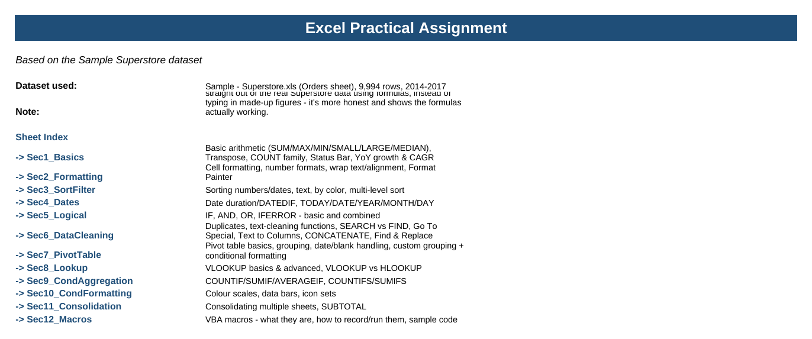
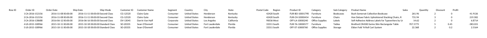
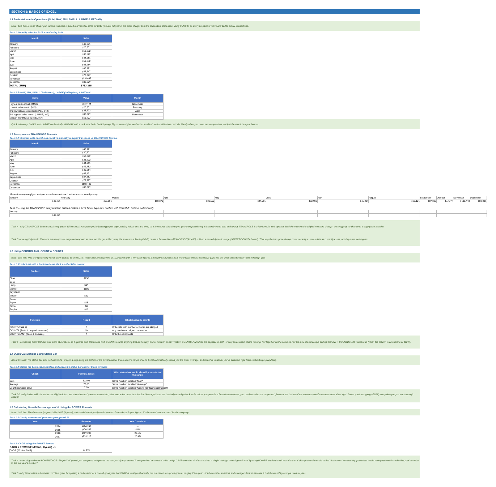
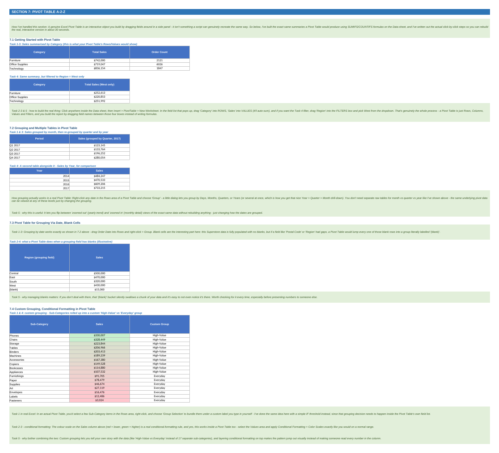
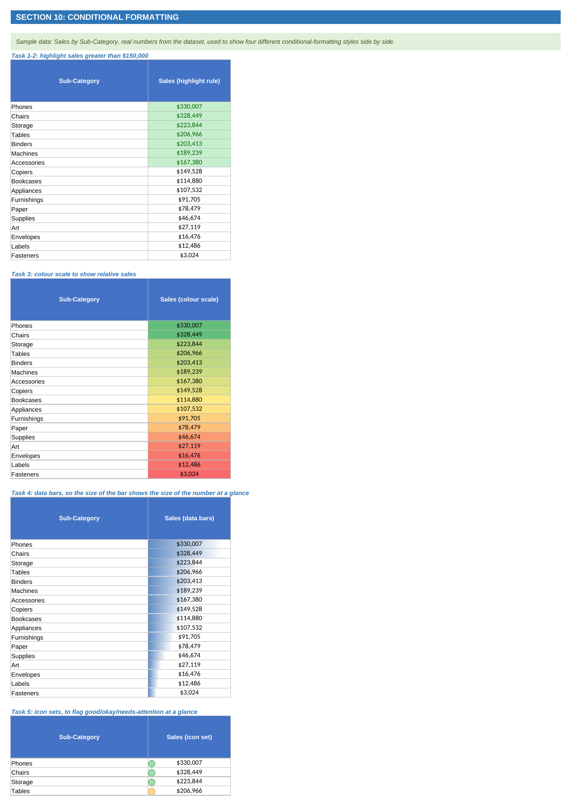

# Excel Practical Assignment — Sample Superstore Dataset

A comprehensive Excel skills exercise covering the full range of practical Excel techniques, built 
entirely on the **Sample Superstore dataset** (9,994 rows of retail sales data).

## 📌 About This Assignment
This assignment builds on foundational Excel knowledge, working through 12 sections covering formulas, 
formatting, sorting/filtering, dates, logical functions, data cleaning, PivotTables, lookups, conditional 
aggregation, conditional formatting, report consolidation, and macros — with every task tied to real 
figures pulled live from the dataset rather than typed-in placeholder numbers.

## 📂 Files in this repo
| File | Description |
|---|---|
| [`Case_Study_Doc.pdf`](./Case_Study_Doc.pdf) | Original assignment brief with all 12 sections and tasks |
| [`Sample_Superstore_Dataset.xls`](./Sample_Superstore_Dataset.xls) | Raw dataset — 9,994 rows of retail sales data |
| [`Excel_Module_Assignment.xlsx`](./Excel_Module_Assignment.xlsx) | Fully solved workbook — all 12 sections, formulas, and explanations |
| `1_cover.png` – `5_conditional_formatting.png` | Screenshots of the solved workbook |

## 🧰 Tools Used
- Microsoft Excel — SUM/MAX/MIN/SMALL/LARGE/MEDIAN, TRANSPOSE, COUNT/COUNTA/COUNTBLANK, IF/AND/OR/IFERROR, 
  VLOOKUP/HLOOKUP, COUNTIFS/SUMIFS, PivotTables, conditional formatting, CONSOLIDATE, SUBTOTAL, VBA Macros

## 📊 Workbook structure
- **Cover** – project summary and sheet index
- **Data** – Superstore dataset (9,994 rows)
- **Sec1_Basics** – SUM/MAX/MIN/SMALL/LARGE/MEDIAN, TRANSPOSE, COUNT functions, status bar calculations, YoY growth & CAGR
- **Sec2_Formatting** – cell formatting, number formats, wrap text/alignment, Format Painter
- **Sec3_SortFilter** – sorting numbers/dates/text, sort by cell color, multi-level sorting
- **Sec4_Dates** – date duration calculations, DATEDIF, date functions
- **Sec5_Logical** – IF, AND, OR, IFERROR, combined logical tests
- **Sec6_DataCleaning** – removing duplicates and errors, UPPER/PROPER/LOWER/TRIM, SEARCH vs FIND, Text to Columns, CONCATENATE, Find & Replace
- **Sec7_PivotTable** – PivotTable basics, grouping, custom grouping, conditional formatting in PivotTables
- **Sec8_Lookup** – VLOOKUP basics and advanced use, VLOOKUP vs HLOOKUP
- **Sec9_CondAggregation** – COUNTIF/SUMIF/AVERAGEIF, COUNTIFS/SUMIFS
- **Sec10_CondFormatting** – color scales, data bars, icon sets
- **Sec11_Consolidation** – Consolidate feature, SUBTOTAL
- **Sec12_Macros** – VBA basics, Developer tab, recording/running/saving macros

Every numeric example is tied to real figures pulled live from the dataset using formulas like SUMIFS — 
nothing is a placeholder, so results update automatically if the underlying data changes.

## 🖼️ Preview

**Cover Sheet**

**Data Sheet**

**Section 1: Basics of Excel**

**Section 7: Pivot Tables**

**Section 10: Conditional Formatting**

 
